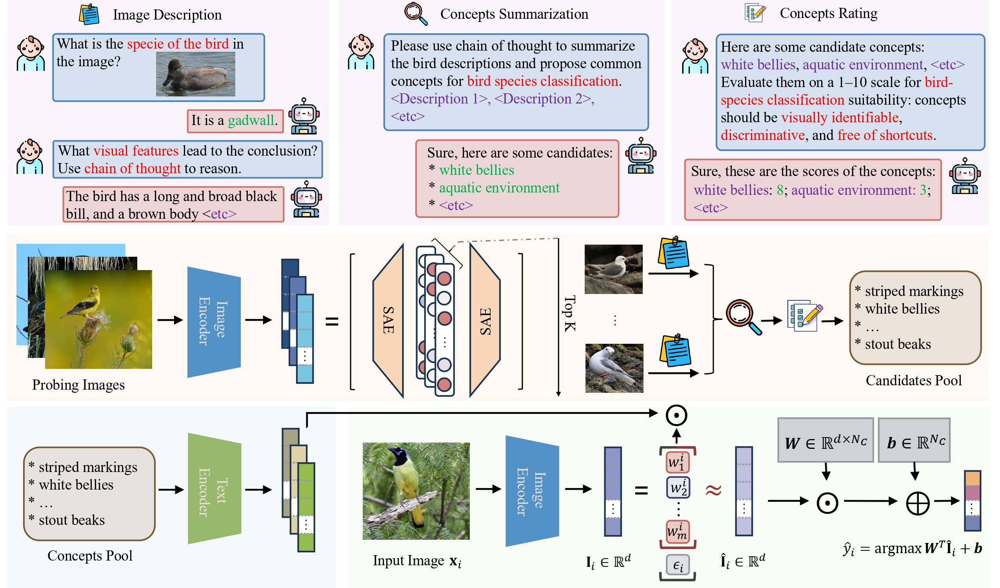

# Concepts from Representations: Post-hoc Concept Bottleneck Models via Sparse Decomposition of Visual Representations
Implementation for AAAI 2026 paper [Concepts from Representations: Post-hoc Concept Bottleneck Models via Sparse Decomposition of Visual Representations](https://arxiv.org/abs/2506.02557)
by [Shizhan Gong](https://peterant330.github.io/), [Xiaofan Zhang](https://zhangxiaofan101.github.io/) and [Qi Dou](https://www.cse.cuhk.edu.hk/~qdou/).



## Set up environments
We recommend to install the environment through pip:

```
pip install -r requirements.txt
pip install -e sparse_autoencoder/
```

## Dataset

`datasets/` stores the dataset-specific data, including images, splits, and concepts. Please check `datasets/DATASET.md` for details.

## Usage

### Step 1: Obtain the visual embeddings for images
```commandline
python script/encode_embedding.py --data cub
```
`--data` can be one of the 11 datasets, including `aircraft`, `cifar10`, `cifar100`, `cub`, `dtd`, `flower`, `food`, `ham`, `ucf`, `RESISC`, and `imagenet`.

### Step 2: Train the SAE model
```commandline
python script/train_sae.py --data cub
```

### Step 3: Generate the image captions.
```commandline
python caption_llava3.py --data cub
```

### Step 4: Extract concept
```commandline
python concept_extraction.py --data cub
```
You need to set the api_key if you would like to use commercial LLMs for concept extraction.

### Step 5: Rating the concept
```commandline
python concept_rating.py --data cub
```

### Step 6: Reconstruction-based concept selection
```commandline
python concept_rating.py --data cub
```

### Step 7: Derive the reconstructed visual representations using the selected concepts
```commandline
python fit_concept.py --data cub
```

### Step 8: Training and evaluating CBMs.
```commandline
python cbm.py --data cub
```

All the intermediate files are stored under `file/`.